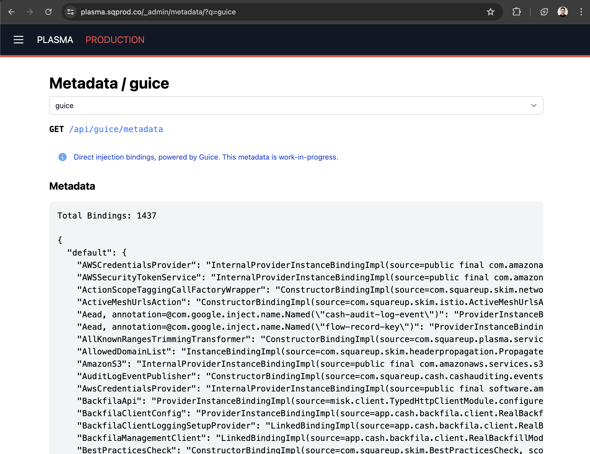
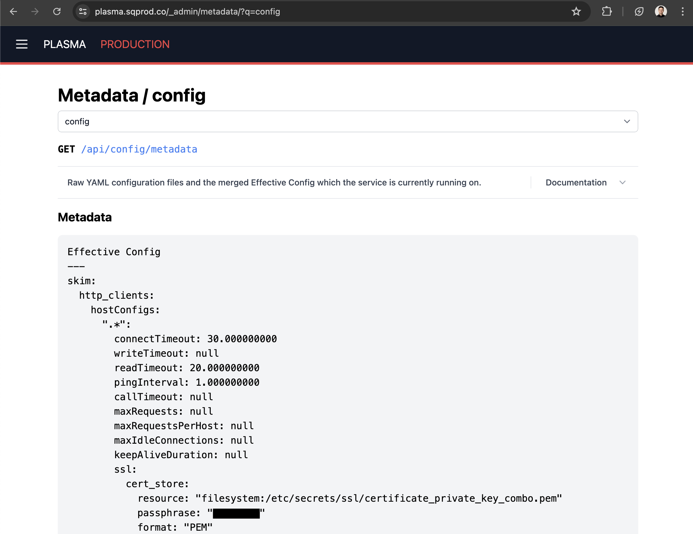
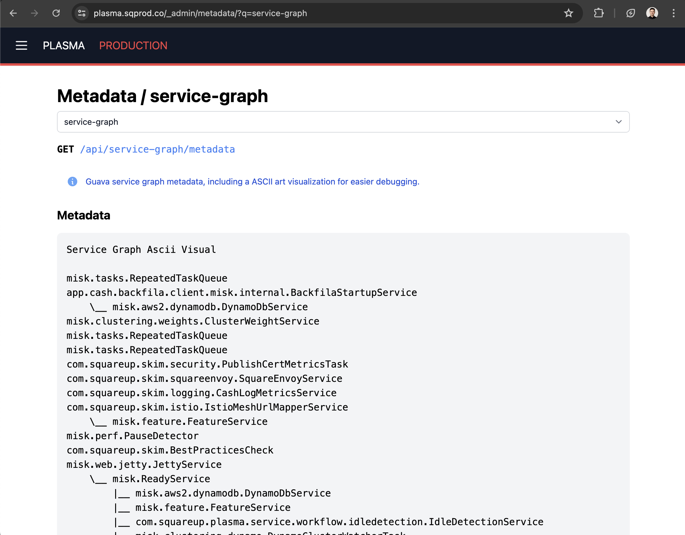

Changelog
==========

Misk releases since 2023-05-27 have been automatically published to Maven on PR merge to master.

The Changelog consequently will not be updated regularly since releases only include the changes of the last PR so the Changelog is now equivalent to the git commit history.

Major and breaking changes will still be documented in the Changelog.

2024 Q2 Summary
===

Misk had a [busy quarter](https://github.com/cashapp/misk/graphs/contributors?from=2024-04-01&to=2024-06-30&type=c) with 98 PRs merged (over one per day!) from over 30 contributors. 

From their efforts, numerous bug fixes, API improvements, and net-new functionality is now available to the growing community of developers building services with Misk.

Thank you Misk Contributors!
---

Misk has an active community of contributors giving back by upstreaming improvements, often motivated by their own experience building and operating Misk services. 

- 5 New Contributors: @addissemagn, @brunofrts, @nliblock, @jessejacksonafterpay, @kalyancash
- 2 External Contributors: @JGulbronson – Faire, @mgulbronson – Faire
- 23 Repeat Contributors: @adrw, @yyuan-squareup, @staktrace, @jvmakine, @mmollaverdi, @traviscj, @SeabertYu, @mslogar-squareup, @keeferrourke, @frojasg, @damar-block, @sahilm, @afkelsall, @RONNCC, @mhickman, @mericson-square, @ean5533, @din-cashapp, @katukota, @aparajon, @mpeyper, @rainecp, @aerb
- Contributors submitted changes and improvements in the following Misk domains: Admin, API, Build, Code Cleanup, Debugging Tools, Dependency Upgrades, Documentation, JobQueue, Redis, TestFixtures Migration, & UI

Thanks to all who made Misk a better framework this quarter!

Showcase: The New Misk UI Stack
---

Over the past year, the Misk admin dashboard has migrated to a new UI stack: kotlinx.html, Hotwire, and Tailwind UI.

This stack doesn't have a dedicated web build (ie. npm node modules, webpack...) and has proven to be a lightweight, developer friendly stack for quickly shipping and maintaining simple UI from your Misk service. Builds are automatically part of your usual Gradle Misk Kotlin build which makes local development and CI builds fast and simple.

> "Having a quick and easy way (for a backend eng 😅) to create custom UI is a power tool in your toolkit! It has helped us to creates internal utilities that makes operating and validate our services a walk in the park. I was able to successfully ship some new UI in one morning!" – @frojasg



Developers have been surprised how fast they can ramp up and ship UI from their service, on the order of a few hours one morning, instead of a few weeks (or months) to build a full JS frontend app. 

See the [Exemplar service code](https://github.com/cashapp/misk/blob/master/samples/exemplar/src/main/kotlin/com/squareup/exemplar/dashboard/ExemplarDashboardModule.kt) in the repo for full examples of the new UI stack in use for building dedicated frontend apps, admin dashboard tabs, and more.

Showcase: New Schema Migrator Gradle Plugin
---

Misk has shipped with a performant database schema migrator for years. It "just works" ensuring table schemas are up to date and running migrations in local develompent and test environments.

Now, the Misk Schema Migrator is available as a standalone Gradle plugin for use without running the service or test suite. For some services previously forced to rely on a more complex plugin like Flyway to use libraries like jOOQ, the new Schema Migrator Gradle Plugin provides a simple way to get that functionality without new non-Misk dependencies. Additionally, the Schema Migrator Gradle Plugin is compatible with the Gradle config cache for optimal performance.

Check out the simple syntax and user docs [here](./misk-schema-migrator-gradle-plugin/README.md) and try it for yourself today.

Showcase: New Metadata tab in the Misk admin dashboard
---



The new Metadata tab makes it easy to expose information from all parts of your running service. Find it at `/_admin/metadata/`!

- Service owners can more easily debug code issues vs connectivity issues.
- Platform teams can expose data through the UI or metadata API with [<50 LOC and no HTML](https://github.com/cashapp/misk/pull/3309).
- Security teams can now audit internal infrastructure configuration across all Misk services easily.



The Metadata tab already includes the following information:

- Configured backfills with [Backfila](https://github.com/cashapp/backfila/pull/392)
- Eventing Kafka topics produced or consumed
- Config YAML ([replacing the existing Config tab](https://github.com/cashapp/misk/pull/3312))
- JVM settings
- Guava service graph
- Guice bindings
- Cron jobs
- ...and more to come (PRs are welcome!)

If you want to expose more metadata from Misk or your internal library or service, [see the Exemplar service code](https://github.com/cashapp/misk/pull/3355).

Showcase: New requireRequest utility APIs
---

A common pattern in request validation is ensuring non-null request fields and throwing a BadRequestException otherwise. The new `requireRequestNotNull` utility API does this in a single line, reducing boilerplate and making the code more readable.

**Before**

```kotlin
requireRequest(request.parameter != null) { "parameter must not be null" }

// later, safe do because of previous null check
request.parameter!!
```

**After**

```kotlin
requireRequestNotNull(request.parameter) { "parameter must not be null" }

// later - no need for !!
request.parameter
```

Misk is open for PRs if there are other broad usage utility functions which would be beneficial to offer to all users of Misk.

Version 2024.07.09
---------------------------------
Breaking changes:
- Remove `@AllowAnyService` annotation (which has been deprecated for months, was rarely used, and has no more internal usage), use `@Authenticated(allowAnyService = true)` instead. 
- Remove support for empty `@Authenticated` annotation, explicit passing of non-empty parameters `capabilities, users, allowAnyUser, or allowAnyService` is now required. Instead of the existing soft-failure error log behavior, an IllegalArgumentException will be thrown if the annotation constructor is empty.
- Empty authentication **allow all** policy has now been changed to **deny all**.
  - Empty Authentication annotation constructors previously would result in an **allow all** policy to any authenticated user or service. 
  - That default has changed. Now, an empty capabilities and empty services list will **deny all** authenticated users or services. 
  - In practice, this grants a new verb to Misk's access annotation language, that of a web action which is installed but no user or service is allowed to access, which is now set with `@Authenticated` (empty constructor).

Version 2024.05.22
---------------------------------
Breaking changes:
- Added `@ExperimentalMiskApi` to `TaggedLogger`. Any code that uses this class will need to `@OptIn(ExperimentalMiskApi::class)`.

Version 2024.05.16
---------------------------------
Breaking changes:
- Remove the deprecated `BETA_PREFIX` val which was used to gate development of the new v2 admin dashboard. It has been deprecated since 2023-06-30 when the v2 admin dashboard was promoted to `/_admin/`.

Version 2024.05.14
---------------------------------
Breaking changes:
- LogRequestResponse can't be target to classes ([#3225](https://github.com/cashapp/misk/pull/3225))

Version 2024.05.06
---------------------------------
Breaking changes:
- Concurrency limiter is now disabled by default ([#3256](https://github.com/cashapp/misk/pull/3256))

Version 0.24.0 *(2022-04-13)*
----------------------------

Unstable public release.

New features and fixes:

- Fill out the Misk BOM ([#2353](https://github.com/cashapp/misk/pull/2353))
- Restore a deleted WebConfig constructor ([#2352](https://github.com/cashapp/misk/pull/2352))
- enable kochiku in CI ([#2351](https://github.com/cashapp/misk/pull/2351))

Version 0.23.0 *(2022-03-30)*
-----------------------------

Unstable public release. Thank you to all the contributors, as always.

Breaking changes:

- Upgrade to use kotlin 1.6 ([#2323](https://github.com/cashapp/misk/pull/2323))
- Move ActionScope and related code to :misk-action-scopes ([#2301](https://github.com/cashapp/misk/pull/2301))
- Remove misk.flags.Flags ([#2341](https://github.com/cashapp/misk/pull/2341))
- misk-metrics: Allow configuring max_age_in_seconds for Prometheus ([#2292](https://github.com/cashapp/misk/pull/2292))

New features:

- misk-actions: Multi-method WebActions ([#2198](https://github.com/cashapp/misk/pull/2198))
- misk-clients: Allow binding for application interceptors in grpc and typed clients ([#2201](https://github.com/cashapp/misk/pull/2201))
- misk-core: Support a configurable delay before shutting down services ([#2238](https://github.com/cashapp/misk/pull/2238))
- misk-core: Allow minimum thread pool size to be configured ([#2210](https://github.com/cashapp/misk/pull/2210))
- misk-core: Record client metrics for incomplete HTTP connections ([#2209](https://github.com/cashapp/misk/pull/2209))
- misk-jdbc: Provide more helpful error message when duplicate migration versions present ([#2325](https://github.com/cashapp/misk/pull/2325))
- misk-jdbc: Default to use modern TLS in JDBC connections ([#2221](https://github.com/cashapp/misk/pull/2221))
- misk-hibernate: add support for FlushEntity listener ([#2220](https://github.com/cashapp/misk/pull/2220))
- misk-feature: Make FakeFeatureFlag overrides composable with FakeFeatureFlagsOverrideModule ([#2306](https://github.com/cashapp/misk/pull/2306))
- misk-feature, wisp-feature: Add strongly typed feature flag support ([#2293](https://github.com/cashapp/misk/pull/2293))
- misk-feature, wisp-feature: Launch Darkly client will use system proxy settings if provided ([#2255](https://github.com/cashapp/misk/pull/2255))
- misk-redis: Implement Redis.hincrBy ([#2269](https://github.com/cashapp/misk/pull/2269))
- misk-zookeeper, wisp-lease: Extend LeaseManager to support Leases as AutoCloseable resources ([#2319](https://github.com/cashapp/misk/pull/2319))
- wisp-config: Add a filesystem preprocessor ([#2275](https://github.com/cashapp/misk/pull/2275))
- wisp-config: Add a classpath preprocessor ([#2268](https://github.com/cashapp/misk/pull/2268))

Fixes:

- misk-admin: Web Actions Tab: handle long primitive when building web forms ([#2300](https://github.com/cashapp/misk/pull/2300))
- misk-clients: Do not require `List<Client*Interceptor>` to be bound when using TypedClientFactory stand-alone ([#2218](https://github.com/cashapp/misk/pull/2218))
- misk-core: Improve handling timeout/reset connection when reading request ([#2279](https://github.com/cashapp/misk/pull/2279))
- misk-core: Configure VegasLimit with higher initial limit ([#2250](https://github.com/cashapp/misk/pull/2250))
- misk-gcp: Properly shut down Google Spanner clients ([#2203](https://github.com/cashapp/misk/pull/2203))
- misk-hibernate: Move StartDatabaseService init code to explicit function ([#2294](https://github.com/cashapp/misk/pull/2294))
- misk-jooq: Use appropriate SQLDialect per configuration ([#2305](https://github.com/cashapp/misk/pull/2305))
- misk-jooq: Don't use "select * from" ([#2231](https://github.com/cashapp/misk/pull/2231))


Version 0.22.0 *(2021-11-03)*
----------------------------

Unstable public release.

Breaking changes:

- The `/error` action is no longer installed by default (#2190)

New features and fixes:

- Ignore @transient fields when constructing queries (#2162)
- Add support for Google Spanner to misk-gcp (#2188)
- Add a default Moshi build in wisp, and move the builder from Misk (#2187)
- Add wisp-token* - copied from misk.tokens (#2186)
- Allow invalid accept headers (#2185)
- Put unack'd jobs on the deadletter queue and remove FakeTransactionalJobQueue (#2180)
- Remove internal visibility modifier from PrometheusHttpService (#2181)
- Add wisp-tracing module (#2171)

Version 0.21.0 *(2021-10-18)*
----------------------------

Unstable public release.

Version 0.20.0 *(2021-08-31)*
----------------------------

Unstable public release.

Breaking changes:

* Leases now use a different package
* Wisp Lease API is changing to handle explicit acquire/release on lease (#2113)
* Log on properties present in config yaml but not in object (#2118)
* Config now requires defaults for primitive types
* Move misk admin components to misk-admin (#2065)
* Reinstate WebActionExceptionMapper sending a response body based on the WebActionException's responseBody (#2050)

New features and fixes:

* Add incr and incrBy operations to misk-redis (#2119)
* Add @fetch as a valid hibernate query annotation (#2112)
* When evaluating JSON LD feature flags, log unknown fields once (#2086)
* Make additional jooq configurations possible (#2078)
* Log a warning if health checks fail (#2063)
* Add support for double feature flags (#2029)
* Send gRPC errors properly (#1983)
* Bump log level for invalid access (#2024)
* misk-policy: To query specific paths, treat document path as urlencoded (#2030)
* Create LaunchDarkly in Wisp (#2088)

Version 0.19.0 *(2021-06-30)*
----------------------------

Unstable public release.

Version 0.18.0 *(2021-06-28)*
----------------------------

Unstable public release.

Version 0.17.1 *(2021-04-29)*
----------------------------

Unstable public release.

Version 0.17.0 *(2021-04-28)*
----------------------------

Unstable public release.


Version 0.16.0 *(2020-12-17)*
----------------------------

Unstable public release.


Version 0.15.0 *(2020-12-03)*
----------------------------

Unstable public release.


Version 0.14.0 *(2020-11-12)*
----------------------------

Unstable public release.


Version 0.13.0 *(2020-07-16)*
----------------------------

Unstable public release.


Version 0.12.0 *(2020-05-06)*
----------------------------

Unstable public release.


Version 0.11.0 *(2020-02-25)*
----------------------------

Unstable public release.


Version 0.10.0 *(2019-01-21)*
----------------------------

Unstable public release.


Version 0.9.0 *(2019-12-06)*
----------------------------

Unstable public release.


Version 0.8.0 *(2019-10-22)*
----------------------------

Unstable public release.


Version 0.7.0 *(2019-08-26)*
----------------------------

Unstable public release.


Version 0.2.5 *(2018-06-11)*
----------------------------

### New

* Cluster interface and DataSourceCluster bindings
* Add a JPAEntityModule for binding entities for a DataSource
* Hook up raw Hibernate APIs
* Use JPA entity types in HibernateModule.
* Introduce FakeResourceLoader
* SchemaMigrator for running and tracking schema migrations.
* Update Misk version in Dockerfiles to 0.2.5
* Drop support for unqualified datasources.
* move exemplars into sample directory in preparation for more of them
* Make all Kotlin warnings build errors
* Allow services to specify dependencies on other services.
* Fast fail on dependency cycles.
* jre8 was deprecated for kotlin 1.2
* Early types for the Transacter APIs
* Queries in the Misk Hibernate API.
* Implement Query with dynamic proxies and reflection
* Offer strict validation and nice errors in ReflectionQueryFactory
* Log the reasons why liveness/readiness checks fail
* URL shortener sample
* Support more operators in Query
* Wire up Hibernate event listeners through Guice.
* HibernateTestingModule.
* Switch tests to MySQL
* Rollback transactions on exceptions
* Delete DataSourceModule. It's redundant with HibernateModule.
* Support ByteString columns
* Misk containers should not run as root
* DbTimestampedEntity

### Fix

* Don't inject until after services are started.
* Tidy up some test cases.
* Fix a missing dependency in exemplar
* Don't use KubernetesHealthCheck with LocalClusterConnector

Version 0.2.4 *(2018-05-14)*
----------------------------

### New

* Add support for protobuf over HTTP
* Cloudwatch Trail logging support
* Add retry() helper
* Add Backoff/ExponentialBackoff
* MiskCaller and authz support
* Adds a DataSourceModule
* Add support for logging to StackDriver

### Fix

* Move static resources from web root into resources
* Move web-specific NetworkInterceptor into web
* Remove use of instance metadata endpoints

Version 0.2.3 *(2018-04-27)*
----------------------------

### New

* Add kubernetes java client so that hosts can know their peers
* Use EventRouter for exemplarchat. Add a static resource mapper
* Create a cluster wide admin healthcheck page
* Change CacheBuilder to be mapOf since no concurrency
* Adds a healthcheck for the kubernetes client
* Adds a local cluster connector so that development functions

### Fix

* Don't treat assembly as a release when running in CI
* Fix tracing startup when none is configured
* Various event router fixes and refactorings

Version 0.2.1 *(2018-03-26)*
----------------------------

### New

* Remove unnecessary check from uploadArchives task (#149)
* Add a RELEASING.md to outline misk release process (#150)
* Move chat into its own example project. (#146)
* Introduce event router api (#147)
* Add basic frontend for exemplarchat
* Add MoshiJsonAdapters and SocketEventJsonAdapter (#151)
* Expose client certificates as action scoped vars (#141)
* Add ClusterMapper interface, refactor RealEventRouter to event loop (#155)
* Handle cluster changes (#156)
* More tests to exercise EventRouter behaviors. (#158)
* Support loading keystores from combined private key and certificate chain PEM files (#157)

### Fix

* Fix event router tests (#159)

Version 0.2.0 *(2018-03-13)*
----------------------------

### New

* Add \_status action
* Split Interceptor into NetworkInterceptor and ApplicationInterceptor
* Introduce websocket support in misk
* Add tracing interceptor for web actions
* Add ActionExceptionLogLevelConfig to control log levels for ActionExceptions
* Allow binding an ExceptionMapper by an Exception type
* Google Cloud Datastore and Cloud Storage support
* Add backend for Zipkin tracer
* Add MiskTracer to facilitate ad-hoc method tracing
* Retrofit based typed client support (#112)
* Enable SSL for both clients and servers (#111)
* Support application/x-www-form-urlencoded parameters (#97)
* Add API for injecting dynamically sourced flags
* Add metrics backend for SignalFx
* Add support for commands
* Upgrade to Gradle 4.5 to support Java 9; add Java 9 to test matrix
* Allow customized exception mappings
* Add support for query strings in urls

### Fix

* Eliminate redundant \_config suffix in config files
* Support Web actions that return Nothing
* Use proper snake-casing for default property names
* Fix Java path param dispatching
* Fix NotFoundAction handling (#134)
* Fix wildcard based content routing
* Fix a bug when a user-defined Interceptor returns a Response object
* Fix up Java translation from Moshi. (#107)

Version 0.1.0 *(2018-02-01)*
----------------------------

Initial release.
