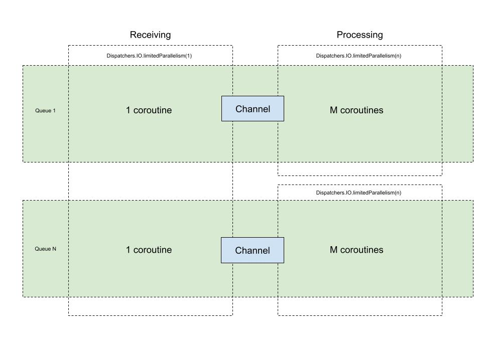

# Module: AWS SQS Module

This module provides a modern, Kotlin-first interface for working with Amazon Simple Queue Service (SQS) in Misk applications. It leverages Kotlin's coroutines and structured concurrency to offer an efficient, type-safe, and easy-to-use message processing system.

### Key Features

- **Kotlin Coroutines Integration**: Native support for suspending functions and structured concurrency
- **Flexible Configuration**: Global and per-queue configuration options for fine-tuned performance
- **Advanced Queue Management**:
  - Automatic retry queue setup and management
  - Dead-letter queue support for failed message handling
  - Configurable visibility timeout and message retention
- **Scalable Processing**:
  - Concurrent message processing with configurable parallelism
  - Efficient message batching and pre-fetching
  - Automatic backoff for failed messages
- **Robust Error Handling**:
  - Automatic message recovery on failures
  - Configurable retry policies
  - Dead-letter queue routing for unprocessable messages
- **Monitoring Ready**:
  - Built-in metrics for queue operations
  - Detailed logging for debugging and monitoring
  - Performance tracking capabilities
- **Type-safe Message Handling**:
  - Support for both blocking and suspending handlers
  - Strongly typed message attributes
  - Automatic message acknowledgment

This module is designed to be a drop-in replacement for the previous AWS SQS implementation, offering improved performance, better resource utilization, and a more developer-friendly API.

## Installation

Follow these steps to integrate the AWS SQS module into your Misk application:

### 1. Add Dependencies

Add the following dependency to your `build.gradle.kts`:

```kotlin
dependencies {
  implementation(project(":misk-aws2-sqs"))
}
```

### 2. Install Required Modules

Install the SQS module in your application by adding it to your service module:

```kotlin
import com.squareup.cash.orc.orcOverride
import com.squareup.skim.aws.sqs.CommonCashQueues
import misk.aws2.sqs.jobqueue.DeadLetterQueueProvider
import misk.aws2.sqs.jobqueue.SqsJobHandlerModule
import misk.aws2.sqs.jobqueue.SqsJobQueueModule
import misk.aws2.sqs.jobqueue.StaticDeadLetterQueueProvider
import misk.aws2.sqs.jobqueue.config.SqsConfig
import misk.inject.KAbstractModule
import misk.jobqueue.QueueName
import misk.web.WebActionModule

class SqsModule(private val config: SqsConfig) : KAbstractModule() {
    override fun configure() {
        // Override configuration in local development to support Orc connection
        install(SqsJobQueueModule(config) { orcOverride("sqs") })

        install(SqsJobHandlerModule.create<ExampleSuspendingHandler>(EXEMPLAR_QUEUE))
        bind<DeadLetterQueueProvider>().toInstance(StaticDeadLetterQueueProvider(CommonCashQueues.GLOBAL_DLQ))
    }

    companion object {
        val EXEMPLAR_QUEUE = QueueName("cash-misk-suspending-exemplar_queue")
    }
}
```

### 3. Define Message Handlers

Create handlers for your queues. You can choose between two types of handlers:

#### Suspending Handler

Suspending handler allows you to call coroutines and manages the coroutine scope for you:

```kotlin
class ExampleSuspendingHandler @Inject constructor() : SuspendingJobHandler {
  override suspend fun handleJob(job: Job): JobStatus {
    // Process the message
    val messageBody = job.body
    
    return when {
      // Successfully processed
      -> JobStatus.OK
      // Message should be retried
      -> JobStatus.RETRY_LATER
      // Message should be sent to dead-letter queue
      -> JobStatus.DEAD_LETTER
      // Message should be retried with exponential backoff
      -> JobStatus.RETRY_WITH_BACKOFF
    }
  }
}
```

#### Blocking Handler

If you don't want to use any suspending code in your handling, you can use `BlockingJobHandler`

```kotlin
class ExampleBlockingHandler @Inject constructor() : BlockingJobHandler {
  override fun handleJob(job: Job): JobStatus {
    // Process the message
    val messageBody = job.body
    
    return JobStatus.OK
  }
}
```

### 4. Add Configuration

If you want to leverage yaml configuration, follow the steps below. Alternatively you can pass an instance of 
`misk.aws2.sqs.jobqueue.config.SqsConfig` to `SqsJobQueueModule` in the example guice module definition above.
In such case it's up to you how you read the values (hardcoded, feature flags, etc.).

#### 4.1 Create Configuration Class
Add the SQS configuration to your service configuration class:

```kotlin
import misk.aws2.sqs.jobqueue.config.SqsConfig
import misk.config.Config

data class ExampleServiceConfig(
  val aws_sqs: SqsConfig,
  // ... other config properties
) : Config
```

#### 4.2 Add YAML Configuration
Add the SQS configuration to your service YAML file

Example relying on the defaults:
```yaml
aws_sqs: {}
```

Example with some values defined:
```yaml
aws_sqs:
  all_queues:
    # Default configuration for all queues
    parallelism: 1
    concurrency: 5
    channel_capacity: 0
    wait_timeout: 20
    max_number_of_messages: 10
    install_retry_queue: true
    region: us-west-2  # Specify your AWS region
    
  per_queue_overrides:
    # Optional: Override configuration for specific queues
    example_queue:
      parallelism: 2
      concurrency: 10
```

### Testing

Integration test can leverage fake jobqueue implementations.

Install fake modules in your test guice module:

```kotlin
install(FakeJobEnqueuerModule())
install(FakeJobHandlerModule.create<DummySuspendingJobHandler>(QUEUE_NAME))
```

Inject FakeJobEnqueuer in your tests:

```kotlin
@Inject private lateinit var jobQueue: FakeJobEnqueuer
```

You can use the fake enqueuer to publish jobs in order to test handler, to peek into the queues
in order to assert it's state, as well as trigger actual processing by your handlers.

Fakes store all jobs in memory and there is no communication with SQS executed.

## Configuration

You can define default configuration for all queue or choose to override it per queue.

The default values are a good starting point. You can adjust them to match your specific performance and behavior needs.

### Concurrency related setting

Refer to the "threading model" section below for in-depth description.

* `parallelism`
  * default value: 1
  * defines how many threads are used to process a given queue
  * increase this parameter to increase throughput if your have a lot of computationally intensive or blocking IO code in
    your handlers. You will also need to increase `concurrency` to at least match this setting.
* `concurrency`
  * default value: 1
  * defines how many coroutines are used to process a given queue. Coroutines are executed on 
    the number of threads defined by the `parallelism` parameter.
  * increase this parameter to increase throughput if you use suspending code. If you also have some 
    computationally intensive and/or blocking IO code, you will also need to bump `parallelism` 
* `channel_capacity`
  * default value: 0
  * defines the buffer size between the polling loop and handling loop. 0 means that the polling loop
    will wait until all messages from the current batch are picked up by handlers before requesting
    another batch of messages. 1 and above means how many jobs can wait in the buffer between the polling
    and handling loop
  * increase this parameter if you want to reduce the latency in job processing. This will be effective 
    only if your handling code is slower than the polling code
  * note: if your `visibility_timeout` is low and your processing code is slow, non-zero value may lead
    to exceeding `visibility_timeout` even before the job is picked up by the handler. This may result
    in increased duplicated processing

### SQS Specific settings

* `max_number_of_messages`
  * default value: 10, range 1-10
  * defines the size of batch requested from SQS
  * this setting optimizes communication with SQS - less network round-trips. However, if given 
    queue does not receive a lot of messages, a number higher than 1 may result long polling and 
    negatively impact latency
* `wait_timeout`
  * default value: null, range 0-20
  * defines how long (in seconds) the polling loop should wait for `max_number_of_messages` to be available. If no
    value is provided, queue settings will be used
  * see [Amazon SQS short and long polling](https://docs.aws.amazon.com/AWSSimpleQueueService/latest/SQSDeveloperGuide/sqs-short-and-long-polling.html)
  * this setting optimizes communication with SQS - less network round-trips. 
* `visibility_timeout`
  * default value: null, 0-43200
  * defines how long (in seconds) given message will be invisible by other processes querying the queue.
    If no value is provided, queue settings will be used
  * note: if the value is smaller than typical processing time, it may result in the job being processed
    multiple times

### Connection settings

* `install_retry_queue`
  * default value: true
  * defines if a retry queue should be installed by default. Retry queue is populated by replaying
    failed jobs from DeadLetterOffice
* `region`
  * default value: null (auto-populated from AWS environment)
  * defines the AWS region to consume the messages from. If not specified, defaults to the deployment 
    region of the service (from `REGION` or `AWS_REGION` environment variable)
* `account_id`
  * default value: null
  * defines the AWS account id that owns the queue. If not specified, AWS assumes the queue is in 
    the caller's account. This setting is only needed for queues defined outside of your AWS account 
    (external queues)

**Note:** The `region` is automatically populated from the AWS environment if not explicitly specified 
in either YAML or dynamic config. This means you typically don't need to specify the region unless 
you're accessing queues in a different region than your service is deployed in.

### Dynamic configuration (optional)

For services that want to dynamically adjust SQS configuration without code deploys, you can configure a dynamic config
flag that returns a JSON object matching the `SqsConfig` structure. When the dynamic config returns a valid configuration,
it **completely replaces** the YAML configuration.

This uses Misk's `DynamicConfig` interface, which is appropriate for service-wide configuration (as opposed to 
`FeatureFlags` which supports per-entity variations).

* `config_feature_flag`
  * default value: null
  * when set, the dynamic config is evaluated at service startup and parsed as a JSON `SqsConfig` object
  * if the dynamic config returns a valid config, it completely replaces the YAML config
  * if the dynamic config returns null/empty or fails to parse, the YAML config is used as a fallback

Example YAML configuration:
```yaml
aws_sqs:
  config_feature_flag: "sqs-config-override"
  all_queues:
    concurrency: 1   # used only if dynamic config is empty/null
    parallelism: 1
```

Example dynamic config JSON value:
```json
{
  "all_queues": {
    "concurrency": 10,
    "parallelism": 3
  },
  "per_queue_overrides": {
    "my_queue": {
      "concurrency": 20
    }
  }
}
```

With the above configuration, when the dynamic config is set:
- The entire YAML config is ignored
- `my_queue` would use concurrency=20, parallelism=3 (from dynamic config's all_queues default)
- All other queues would use concurrency=10, parallelism=3 (from dynamic config's all_queues)

**Important notes:**
- Dynamic config values are read once at service startup. To pick up new values, the service must be restarted.
- If `config_feature_flag` is configured, a `DynamicConfig` implementation must be bound in your Guice module.
  If no `DynamicConfig` is bound but the flag name is configured, the service will fail to start with a clear error message.
- If the dynamic config returns null/empty or cannot be parsed, the service falls back to YAML configuration (with a warning log).
- The dynamic config completely replaces the YAML config - there is no merging. This keeps the behavior simple and predictable.
- The `region` default from the AWS environment is automatically applied to both YAML and dynamic config if not explicitly specified.

## Threading model

Receiving and processing messages is handled by separate views on the `Dispatchers.IO`:
- querying SQS is done on a single thread
- for each subscribed queue, a receiving coroutine is created
- received jobs are sent to a dedicated per-queue channel with a default size of 0. This is configurable
- by default, there is a single thread with a single coroutine running dedicated to processing
  of jobs from a given queue. This is configurable as well.

How the configuration impacts the processing:
- increasing the channel size allows to pre-read jobs from SQS. This may be helpful to reduce the
  latency, but if the handler takes more time to process than the visibility timeout, it may lead
  to increased duplicated and out of order processing
- increasing the concurrency spins up more coroutines per queue. This may increase the throughput
  of processing, if processing mostly uses non-blocking operations
- increasing the parallelism will increase the thread pool size per-queue. Together with increased
  concurrency it may increase the throughput of processing, if processing involves heavy computations
  or blocking operations

It's advised to start with the default settings and adjust based on specific workloads.



## Differences to the previous misk-aws implementation

* uses AWS SDK v2
* exposes suspending API
* handlers return status and don't make calls to SQS. Acknowledging jobs is done by the framework code
* no dependency on the lease module. There will be at least one handler per service instance
* optional dynamic config support for SQS configuration (requires explicit configuration, see "Dynamic configuration")
* metrics are updated to v2, names of the metrics have been changed

## Migration

New module provides a very similar behaviour to the previous one. Thanks to that, migration is 
limited to a few changes only:

1. Replace the dependency and guice modules with the ones described in the installation section.
2. Update your handler to extend one of the new interfaces.
3. Modify your handler code to return correct status instead of calling methods on the job object.
4. Optionally, provide YAML configuration if needed.
5. Update your tests to use new fakes.
